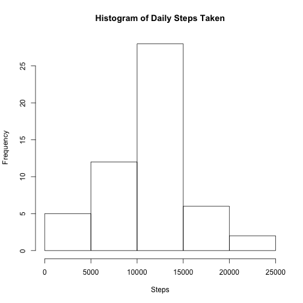
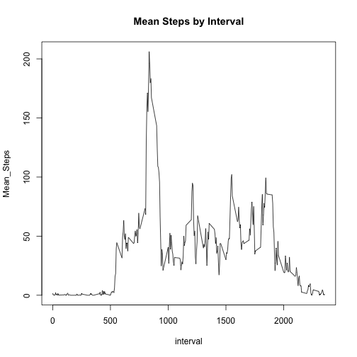
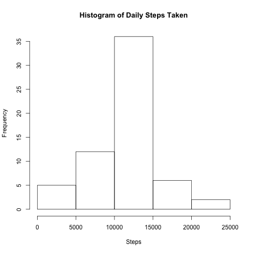
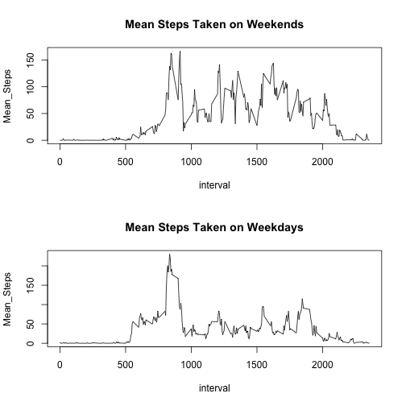

#Project Assignment 1 - Reproducible Research
##Aaron Ludwin

Load relevant packages, read the data, and remove the rows of data that include NA values


```r
require(dplyr)
```

```
## Loading required package: dplyr
```

```
## 
## Attaching package: 'dplyr'
```

```
## The following objects are masked from 'package:stats':
## 
##     filter, lag
```

```
## The following objects are masked from 'package:base':
## 
##     intersect, setdiff, setequal, union
```

```r
require(ggplot2)
```

```
## Loading required package: ggplot2
```

```
## Warning: package 'ggplot2' was built under R version 3.2.4
```

```r
data <- read.csv("~/Desktop/activity.csv")
complete <- complete.cases(data)
dataComplete <- data[complete,]
```

In this portion of the code, I'm grouping and summarizing the data for the histogram. You number of steps taken each day is in the summarized variable 


```r
grouped <- group_by(dataComplete, date)
summarized <- summarise(grouped, steps = sum(steps))
```


Here's the histogram utilzing the "summarized" data from the previous step 


```r
hist(summarized$steps, xlab = "Steps", main = "Histogram of Daily Steps Taken")
```



Calculate the mean number of steps taken


```r
meanSteps <- mean(summarized$steps)
medianSteps <- median(summarized$steps)
```

The mean number of steps taken each day is 1.0766189 &times; 10<sup>4</sup> and 10765 is the median number of steps taken.


In this portion of the code, I'm grouping and summarizing the data for the time series. We're aggregating the data by interval and calculating the mean number of steps for each interval 


```r
intervalGroup <- group_by(dataComplete, interval)
intervalSummarized <- summarize(intervalGroup, Mean_Steps = mean(steps))
```

Plot the time series utilizing the calculations above


```r
plot(intervalSummarized, type = "l", main = "Mean Steps by Interval")
```



Determine which 5-minute interval, on average across all the days in the dataset, contains the maximum number of steps.


```r
Interval <- max(intervalSummarized$Mean_Steps)
filteredData <- filter(intervalSummarized, Mean_Steps == Interval)
maxInterval <- filteredData$interval
```

Interval 835 contains the maximum number of steps, on average across all the days in the dataset.

Next, we want to calculate and report the number of missing values in our original dataset 


```r
missingValues <- sum(is.na(data$steps))
```

There are a total of 2304 missing values in our original dataset

We're going to fill in the missing observations from our original dataset using the mean number of steps taken for each interval.


```r
for(i in 1:nrow(data)){
  if(is.na(data$steps[i])){
    for(j in 1:nrow(intervalSummarized)){
      if(data$interval[i] == intervalSummarized$interval[j]){
        data$steps[i] <- as.integer(intervalSummarized$Mean_Steps[j])
      }
    }
  }
}
```

Now, we're going to reaggregate our data so that we can create a histogram for the number of steps taken.


```r
groupedNew <- group_by(data, date)
summarizedNew <- summarise(groupedNew, steps = sum(steps))
```

Here's the histogram utilzing the "summarized" data from the previous step.


```r
hist(summarizedNew$steps, xlab = "Steps", main = "Histogram of Daily Steps Taken")
```



Calculate the mean and median number of steps taken. Calculate the difference between the results in the dataset with the missing values removed.


```r
newMeanSteps <- mean(summarizedNew$steps)
newMedianSteps <- median(summarizedNew$steps)
meanDifference <- abs(newMeanSteps - meanSteps)
medianDifference <- abs(newMedianSteps - medianSteps)
```

1.074977 &times; 10<sup>4</sup> is the new mean number of steps taken with the missing values filled and the median number of steps is 10641. The mean differs by 16.4181874 steps from the previous data set and the median differs by 124.


We want to figure out if there are there differences in activity patterns between weekdays and weekends, so we're going to need to create a new factor variable in the dataset with two levels – “weekday” and “weekend” indicating whether a given date is a weekday or weekend day. 


```r
data$date <- weekdays(as.Date(data$date))
weekday <- c("Monday","Tuesday", "Wednesday", "Thursday", "Friday")
for(i in 1:nrow(data)){
  if(data$date[i] %in% weekday){
    data$date[i] <- "Weekday"
  } else {
    data$date[i] <- "Weekend"
  }
}
```

Now, we're going to make a panel plot containing a time series plot (i.e. 𝚝𝚢𝚙𝚎 = "𝚕") of the 5-minute interval (x-axis) and the average number of steps taken, averaged across all weekday days or weekend days (y-axis). 


```r
dateintervalGroup <- group_by(data, interval, date)
dateintervalSummarized <- summarize(dateintervalGroup, Mean_Steps = mean(steps))
weekdayData <- filter(dateintervalSummarized, date == "Weekday")
weekdayData <- select(weekdayData, -date)
weekendData <- filter(dateintervalSummarized, date == "Weekend")
weekendData <- select(weekendData, -date)
```


```r
par(mfrow=c(2,1))
plot(weekendData, type = "l", main = "Mean Steps Taken on Weekends")
plot(weekdayData, type = "l", main = "Mean Steps Taken on Weekdays")
```


